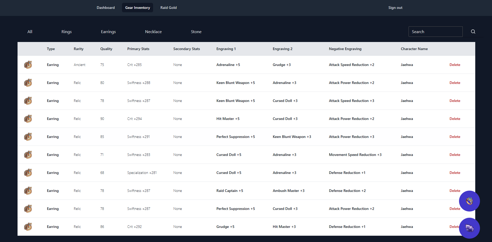

# Lost Ark Gear Inventory (LoaGear)

Keep track of all usuable accessories and stones in your entire roster.

 

View based on accessory type, engraving, stats, or character.

## A brief history

I play Lost Ark on a regular basis. Currently, as of writing this, I have almost 5k hours in the game (not really proud of that btw). However, playing this game made me realize that there was a lot of potential in making cool applications that can assist players in their adventures.
With this small application, I wanted to create something that would keep a log of all accessories that can be used for my alts. Since I usually horde all these stones and accessories, having a tool like this would help reduce the time swapping characters, checking
the character inventory and storage.

# Technology Used
<h3>Frontend</h3>

  HTML, CSS, Javascript

<h3>Backend</h3>

  Node.js, Express, MongoDB, Mongoose, EJS

# Optimizations

There are a lot of things I would've loved to have done differently with this app; however, this was mainly built as an MVP rather than an official application. But I will list off a few optimizations that I will get back to in the near future.

1. Load times and data usage:
   - From my short testing, the load times were okay, but maybe the data usage was on the higher side. Definitely changing up my code base, reducing file size, compressing code, and getting rid of redundant code would be the first thing I would change given the chance.

2. Appearance:
   - On a biased look, I thought the appearance and UI were alright as an MVP. However, getting some feedback from players who play Lost Ark, they have given me some insight and possible areas of improvement as to where changes could be applied.
  
3. Functionality:
   - There are plenty of things that I would love to change when it comes to the core functionality of the application. For example, maybe optimizing the view swapping function or maybe optimizing the pagination for each view. I ultimately wanted to get my ideas       acrossed and have an actual function web app so optimization was not really a priority.

# Future Implementations

As mention above this app was made using Node.js and EJS as a template language. Personally, I would've loved to use React for the frontend and NEXT.js for the backend. 
   
Unfortunately, I'm still learning React and NEXT.js, and I felt like my insufficient knowledge would have hindered the development of this MVP. Plus, I have more experience with Express and EJS.

